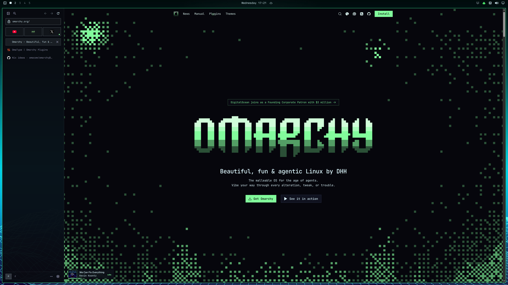

<p align="center">
  
</p>

# Omaweb



Omaweb is a keyboard-driven web browser for Linux with first-class Wayland support. It keeps tabs in
a sidebar, separates browsing identities into Spaces, and follows the desktop theme.

**Omaweb is alpha.**

## Highlights

- Spaces keep cookies, logins, history, permissions, sessions, and tabs separate.
- The Omnibar opens addresses, searches the web, switches tabs and Spaces, and runs commands.
- Keyboard navigation includes configurable bindings, link hints, and a shortcut sheet generated
  from the active keymap.
- Pinned tabs, Private windows, site-requested Auxiliary windows, and recently closed tabs are built
  in.
- Content blocking supports EasyList, EasyPrivacy, cosmetic rules, Scriptlets, and Substitute
  resources.
- Site information shows connection state, certificate errors, permissions, stored data, and Content
  blocking activity.
- High-risk downloads require confirmation, lose their execute permissions, and never open
  automatically.
- Omaweb follows the desktop theme and can import terminal and Omarchy themes without restarting.

Every browser action is available from the command panel.

## Install

Build and install the Arch Linux package from the repository:

```sh
git clone https://github.com/villekivela/omaweb.git
cd omaweb/packaging
makepkg -si
```

Omaweb uses the system QtWebEngine, so engine security updates arrive through the distribution. On
`aarch64`, build from source. Published packages are `x86_64` only.

To install a downloaded release package:

```sh
sudo pacman -U omaweb-git-*.pkg.tar.zst
```

Install `fcitx5-qt` if you use an input method. Omarchy configures Qt applications to use `fcitx`
but does not install the Qt plugin.

## Keyboard shortcuts

`Primary` means Control on Linux and Command on macOS.

| Keys                          | Action                                    |
| ----------------------------- | ----------------------------------------- |
| `Primary+K` or `:`            | Open the command panel                    |
| `Primary+L` or `o`            | Open an address or search                 |
| `Primary+T` or `t`            | Start a new tab                           |
| `Primary+W` or `x`            | Close the current tab                     |
| `Primary+F` or `/`            | Find in the page                          |
| `Primary+Shift+I`             | Toggle Developer tools                    |
| `Primary+B`                   | Hide or show the sidebar                  |
| `f` or `Shift+F`              | Follow a link here or in a background tab |
| `j`, `k`, `d`, `u`, `gg`, `G` | Scroll the page                           |
| `Primary+/` or `?`            | Show all current bindings                 |

Single-key commands follow the Keyboard navigation setting. Editable controls still receive typing,
and sites can keep selected conflicting keys. See the
[default keymap](assets/keybindings/default.json) for every binding.

## Configuration

User configuration lives in `$XDG_CONFIG_HOME/omaweb`, or `~/.config/omaweb` when that variable is
unset:

- `keybindings.json` controls bindings and per-site key passthrough.
- `theme.json` controls the browser palette.
- `search-engines.json` controls local search engines. DuckDuckGo is the default, and remote
  suggestions are off.

Desktop theme following needs no setup. On Omarchy, Omaweb installs its theme template on first
start so `omarchy theme set` can update the browser without a restart. See the
[Omarchy integration guide](integrations/omarchy/README.md) for compositor blur and opacity rules.

## Build

Omaweb requires Qt, CMake, Ninja, Clang with C++ support, and ccache. The build configuration
defines the supported tool versions.

```sh
scripts/bootstrap_content_blocker.sh
cmake --preset dev
cmake --build --preset dev
ctest --preset dev
```

Run the browser with `./build/dev/omaweb`. The [development guide](docs/development.md) covers
setup, build presets, the UI lab, packaging, and releases.

Before changing browser behavior, read the [domain glossary](CONTEXT.md),
[product requirements](docs/product/requirements.md), and [architecture](docs/architecture.md).
[CONTRIBUTING.md](CONTRIBUTING.md) covers the contribution workflow.

## Scope

Omaweb does not include bookmarks, password management, third-party WebExtensions, Account, Sync,
installed web applications, Reader mode, translation, browser-data import, View source,
spellchecking, DRM, or macOS distribution. These are deliberate scope decisions, not unfinished
features.

## Privacy and security

Omaweb has no telemetry, advertising identifier, browser account, cloud sync, push service, or
automatic crash upload. The [network request ledger](docs/network-requests.md) lists every automatic
request the browser makes.

Each page runs in a sandboxed renderer. Omaweb refuses to start if its command line disables the
sandbox or the Linux host cannot meet the sandbox requirements. An ordinary session opens no
listening socket.

Omaweb has no URL-reputation service and does not warn about known phishing, malware, or dangerous
downloads. [Read the decision](docs/adr/0032-ship-without-url-reputation.md). Settings reports
whether the installed engine meets Omaweb's security baseline, and CI checks upstream security
releases. See [SECURITY.md](SECURITY.md) to report a vulnerability.

## License

Omaweb's code is licensed under MPL 2.0. Third-party components keep their own licenses. See
[THIRD_PARTY_NOTICES.md](THIRD_PARTY_NOTICES.md) for the full inventory.
