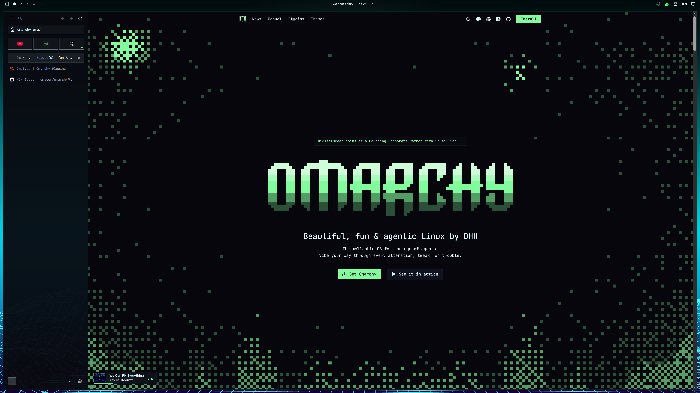

<p align="center">
  
</p>

<h1 align="center">Omaweb</h1>



Omaweb is a keyboard-driven web browser for Linux with first-class Wayland support. It keeps tabs in
a sidebar, separates browsing identities into Spaces, and follows the desktop theme.

**Omaweb is alpha.**

## Highlights

- The Omnibar is where every new tab starts, resting on the Start page's night road. It opens
  addresses, searches the web with the engine's suggestions, switches to an open tab in any Space,
  and runs commands.
- Spaces keep cookies, logins, history, permissions, sessions, and tabs separate.
- Keyboard navigation includes configurable bindings, link hints, and a shortcut sheet generated
  from the active keymap.
- Pinned tabs, Private windows, site-requested Auxiliary windows, and recently closed tabs are built
  in.
- Content blocking supports EasyList, EasyPrivacy, cosmetic rules including procedural ones,
  Scriptlets, and Substitute resources.
- Site information shows connection state, the certificate chain, certificate errors, permissions,
  stored data, and Content blocking activity.
- Screenshot page saves what the page area shows as a PNG in the downloads location, Screenshot full
  page saves the whole page from top to bottom, and the Copy commands put either on the clipboard.
- Signing in with a security key or a passkey on one goes through Omaweb's own prompts for the
  touch, the PIN and the account, in a Space or a Private window alike. The engine reaches a USB
  security key, not a phone or a passkey stored on the computer, and the prompts say so.
- High-risk downloads require confirmation, lose their execute permissions, and never open
  automatically.
- Omaweb follows the desktop theme and can import terminal and Omarchy themes without restarting. A
  page that asks for it, with `<meta name="omaweb-palette">`, is handed the palette too.

Every browser action is available from the Omnibar.

## Install

```sh
curl -fsSL https://omaweb.app/install | sh
```

The script, [`scripts/install.sh`](scripts/install.sh), prints the lines it adds to
`/etc/pacman.conf`, where the signing key comes from and its fingerprint, and the `pacman` command
it runs, then asks once before it uses `sudo`. `sh -s -- --yes` skips the question. It stops if the
key it downloads is not the one below, leaves an `[omaweb]` section already in `pacman.conf` alone,
and keeps a copy of the file before changing it. A second run redoes none of that, and its
`pacman -Syu` only upgrades what is out of date.

To make the same steps by hand, add the Omaweb repository to `/etc/pacman.conf`, and Omaweb arrives
and upgrades with the rest of the system:

```ini
[omaweb]
SigLevel = Required DatabaseRequired
Server = https://github.com/villekivela/omaweb/releases/download/repo-$arch
```

Import the key the packages are signed with, once. The fingerprint is the one thing to check here:
it comes from this page rather than from the keyserver, and pacman refuses any package it did not
sign.

```sh
curl -fsSLO https://raw.githubusercontent.com/villekivela/omaweb/main/security/repo-signing-key.asc
sudo pacman-key --add repo-signing-key.asc
sudo pacman-key --lsign-key FDA535B2185755EA718BEA585DBF15FE484EFA64
sudo pacman -Syu omaweb
```

The key is fetched over HTTPS rather than from a keyserver because keyservers answer on port 11371,
which plenty of networks do not let out, and a machine that cannot reach one gets
`keyserver receive failed: No route to host` with no hint of what to do next.
`pacman-key --recv-keys FDA535B2185755EA718BEA585DBF15FE484EFA64` fetches the same key where that
port is open. Either way it is the fingerprint above that decides whether the key is the right one.

Removing the repository leaves the installed package alone.

To install a downloaded release package instead, without the repository:

```sh
sudo pacman -U omaweb-*.pkg.tar.zst
```

Omaweb uses the system QtWebEngine, so engine security updates arrive through the distribution.
Packages are published for `x86_64` and for `aarch64`; the `aarch64` ones are built on Arch Linux
ARM and use the QtWebEngine that distribution ships. To build the package from the checkout instead:

```sh
git clone https://github.com/villekivela/omaweb.git
cd omaweb/packaging
makepkg -si
```

Install `fcitx5-qt` if you use an input method. Omarchy configures Qt applications to use `fcitx`
but does not install the Qt plugin.

## Keyboard shortcuts

`Primary` means Control on Linux and Command on macOS.

| Keys                          | Action                                    |
| ----------------------------- | ----------------------------------------- |
| `Primary+K` or `:`            | Search the commands in the Omnibar        |
| `Primary+L` or `o`            | Open an address or search                 |
| `Primary+T` or `t`            | Start a new tab                           |
| `Primary+W` or `x`            | Close the current tab                     |
| `Primary+F` or `/`            | Find in the page                          |
| `Primary+Shift+I`             | Toggle Developer tools                    |
| `Primary+B`                   | Hide or show the sidebar                  |
| `f` or `Shift+F`              | Follow a link here or in a background tab |
| `j`, `k`, `d`, `u`, `gg`, `G` | Scroll the page                           |
| `Primary+/` or `?`            | Show all current bindings                 |

Single-key commands follow the Keyboard navigation setting. Editable controls still receive typing,
and sites can keep selected conflicting keys. See the
[default keymap](assets/keybindings/default.json) for every binding.

## Agents

A coding agent on the same computer can use Omaweb through the `omaweb` CLI. Link the skill the
package installs into your agent's skills directory, then turn on Allow agents in Settings, under
agents:

```sh
ln -s /usr/share/omaweb/skills/omaweb ~/.claude/skills/omaweb
```

To hand the page you are reading to your agent, type `:ask` and your request in the Omnibar:

```text
:ask summarize this
:ask fill this in from ~/notes/address.md
```

Omaweb opens your terminal through `xdg-terminal-exec`, running the agent command from Settings
(`claude` by default) with the tab and your words, and you watch the agent work in the tab. The
first time it reaches one of your Spaces, Omaweb asks you once whether it may. Omaweb holds no model
and sends nothing to an AI service: the agent is your own program.

## Projects

Omaweb is the browser you and your coding agent share while you build. Start your dev server as you
always do, then run `omaweb dev` in the project's folder with the address it serves:

```sh
cd ~/code/shop
omaweb dev localhost:5173
```

The first time, Omaweb makes a Space named after the folder, remembers the folder and the address,
and shows the app there. Later, a bare `omaweb dev` in that folder or any folder below it brings the
Space forward and selects the app's tab. While the server is not answering yet, the Start page's
road drives, and the app loads once it answers. Omaweb never starts or stops your server.

`:ask` in a project's Space starts your agent in the project's folder, so it reads that project's
`CLAUDE.md`. To run the agent somewhere else, such as in a container or on another machine, record a
command for the project. `{dir}` stands for the project's folder:

```sh
omaweb dev localhost:5173 --agent 'incus exec dev --cwd {dir} -- claude'
```

Settings lists each project under spaces, with Forget project to clear it. `omaweb dev` grants
agents nothing: the first time your agent reaches the Space, Omaweb asks you as it does anywhere.

## Agent in a container

Your agent can run in a sandbox while Omaweb runs on your desktop. The agent drives the browser with
the same `omaweb` command and skill. The sandbox needs three things from the desktop:

- **The `omaweb` command.** The `omaweb-cli` package holds it and the skill, and needs only Qt's
  base. On Arch, add the [repository](#install) and run `sudo pacman -S omaweb-cli`. Elsewhere,
  build it from a checkout with `cmake --preset cli && cmake --build --preset cli`, which needs Qt 6
  base, CMake and Ninja.
- **The Agent socket**, `$XDG_RUNTIME_DIR/omaweb/control.sock` on the desktop. Inside the sandbox,
  set `OMAWEB_CONTROL_SOCKET` to wherever you put it.
- **Your project at the same path**, so `{dir}` in the agent command names the same folder on both
  sides, and **the dev server's port**, so the browser reaches it as `localhost`.

Anything that can open the socket acts as you in the browser. Forwarding it into a sandbox gives the
sandbox that power: browser commands work from it at once, and pages and Spaces still need Allow
agents and your answer to the Space prompt.

The recipes below use a project in `~/code/shop` whose dev server listens on port 5173. Run the
agent command once in the project's folder on the desktop, then `:ask` in the project's Space starts
the agent in the sandbox.

### Incus

Forward the port out of the container, mount the project at its own path, and forward the socket in.
The socket device listens inside the container and connects to the desktop's socket as you:

```sh
incus config device add dev shop-port proxy \
    listen=tcp:127.0.0.1:5173 connect=tcp:127.0.0.1:5173
incus config device add dev shop disk source="$HOME/code/shop" path="$HOME/code/shop" shift=true
incus config device add dev omaweb proxy bind=instance \
    listen=unix:/run/omaweb.sock connect=unix:"$XDG_RUNTIME_DIR/omaweb/control.sock" \
    uid=1000 gid=1000 mode=0600 security.uid="$(id -u)" security.gid="$(id -g)"
incus config set dev environment.OMAWEB_CONTROL_SOCKET=/run/omaweb.sock
omaweb dev localhost:5173 --agent \
    'incus exec dev --user 1000 --group 1000 --env HOME=/home/me --cwd {dir} -- claude'
```

1000 and `/home/me` are your user inside the container. The agent runs as that user, so what it
writes in the project stays yours on the desktop. The dev server in the container listens on
`127.0.0.1:5173`.

### Docker or Podman

Bind-mount the socket's directory rather than the socket, so the mount survives the browser
restarting, and run as your own user, so the socket's mode lets you in:

```sh
docker run -d --name dev --user "$(id -u):$(id -g)" \
    -p 127.0.0.1:5173:5173 \
    -v "$HOME/code/shop:$HOME/code/shop" \
    -v "$XDG_RUNTIME_DIR/omaweb:/run/omaweb" -e OMAWEB_CONTROL_SOCKET=/run/omaweb/control.sock \
    your-dev-image sleep infinity
omaweb dev localhost:5173 --agent 'docker exec -it -w {dir} dev claude'
```

The image needs a home for that user that the agent can write, because the agent keeps its settings
there. The dev server in the container listens on `0.0.0.0:5173`. This is rootful Docker. Rootless
Docker runs your user as another, which the socket's directory refuses, so use rootless Podman
instead: `podman` for `docker`, with `--userns=keep-id` added.

### Distrobox

Nothing to forward: a Distrobox shares your home, your runtime directory and the network with the
desktop, so the default socket path and `localhost` already work inside it. Install `omaweb-cli` in
the box, then:

```sh
omaweb dev localhost:5173 --agent 'distrobox enter dev -- claude'
```

No `{dir}` is needed: `:ask` starts the terminal in the project's folder, and Distrobox enters the
box in the folder it was started in.

### Another host over SSH

Open one session that forwards the socket to the host and the port back, and keep it open while you
work. Run the dev server in it:

```sh
ssh -R /tmp/omaweb.sock:"$XDG_RUNTIME_DIR/omaweb/control.sock" -L 5173:localhost:5173 devbox
```

Set `StreamLocalBindUnlink yes` in the host's `sshd_config`, or remove `/tmp/omaweb.sock` before
reconnecting, because sshd will not replace a socket a previous session left. The project has to be
at the same path on the host.

`:ask` adds its prompt as the command's last argument, and SSH hands its command to the host's
shell, which would split the prompt again. A small script on the desktop quotes it for a Bash login
shell on the host. Save it as `~/.local/bin/devbox-claude` and make it executable:

```bash
#!/bin/bash
# devbox-claude <folder> <prompt>
exec ssh -t devbox "cd ${1@Q} && OMAWEB_CONTROL_SOCKET=/tmp/omaweb.sock exec claude ${2@Q}"
```

```sh
omaweb dev localhost:5173 --agent 'devbox-claude {dir}'
```

## Configuration

User configuration lives in `$XDG_CONFIG_HOME/omaweb`, or `~/.config/omaweb` when that variable is
unset:

- `keybindings.json` controls bindings and per-site key passthrough.
- `theme.json` controls the browser palette.
- `search-engines.json` controls local search engines. DuckDuckGo is the default, and remote
  suggestions are off.

Desktop theme following needs no setup. On Omarchy, Omaweb installs its theme template on first
start so `omarchy theme set` can update the browser without a restart. See the
[Omarchy integration guide](integrations/omarchy/README.md) for compositor blur and opacity rules.

## Find tabs from Omarchy's menu

On Omarchy 4, `omaweb tabs --pick` opens Omarchy's own menu with the tabs of every Space. Each row
is a tab's title, with its site and Space under it. Choosing one selects the tab and brings Omaweb
forward, in whatever Space the tab lives. Private windows are never listed. It needs
`omarchy-menu-select`, which comes with Omarchy 4, and says so and exits 1 where that is missing.
Closing the menu does nothing.

Omaweb writes none of Omarchy's configuration, so the keybinding and the menu row are yours to add.
For a key, put this in `~/.config/hypr/bindings.lua`:

```lua
o.bind("SUPER + ALT + T", "Omaweb tabs", "omaweb tabs --pick")
```

For a row on Omarchy's root menu, add this to `~/.config/omarchy/extensions/omarchy-menu.jsonc`:

```jsonc
"omaweb-tabs": {"icon": "󰖟", "label": "Omaweb tabs", "action": "omaweb tabs --pick"}
```

Selecting the tab is `omaweb focus --raise`. Plain `omaweb focus` only selects the tab and leaves
the window where it is. `omaweb tabs --all --json` lists every Space's tabs, each with its id,
title, address, and its Space's id and name, for a script of your own.

## Languages

Omaweb follows the system locale, read from `LC_ALL`, `LC_MESSAGES` or `LANG`, in that order. The
chrome is available in English and Finnish (Suomi), and a locale without a translation shows
English. Settings names the locale in use and what chose it. See the
[translation guide](docs/localization.md) to add a language.

## Build

Omaweb requires Qt, CMake, Ninja, Clang with C++ support, and ccache. The build configuration
defines the supported tool versions.

```sh
scripts/bootstrap_content_blocker.sh
cmake --preset dev
cmake --build --preset dev
ctest --preset dev
```

Run the browser with `./build/dev/omaweb`. The [development guide](docs/development.md) covers
setup, build presets, the UI lab, packaging, and releases.

Before changing browser behavior, read the [domain glossary](GLOSSARY.md),
[product requirements](docs/product/requirements.md), and [architecture](docs/architecture.md).
[CONTRIBUTING.md](CONTRIBUTING.md) covers the contribution workflow.

## Scope

Omaweb does not include bookmarks, password management, third-party WebExtensions, an Account
system, installed web applications, Reader mode, translation, browser-data import, View source,
spellchecking, a custom user agent, print preview, DRM, or macOS distribution. These are deliberate
scope decisions, not unfinished features.

## Privacy and security

Omaweb has no telemetry, advertising identifier, browser account, hosted Omaweb service,
[push service](docs/research/web-push.md), or automatic crash upload. The
[network request ledger](docs/network-requests.md) lists every automatic request the browser makes.

Sync is optional, off until you connect it, and unavailable in a Private window. It copies Spaces,
tabs, keybindings, filter subscription addresses, and four approved Settings keys between your own
machines through a private git repository you own. Spaces and tabs are encrypted before upload;
keybindings, subscription addresses, and those settings are readable in that repository. Passwords,
payment cards, cookies, browsing history, form history, saved addresses, downloads, site
permissions, and every Private window never enter Sync. Payment cards are kept in your desktop's
keyring and nowhere else. [What is synced, and what is not](docs/sync-privacy.md) states the full
boundary and the forge permissions it asks for.

HTTPS-only mode is on by default: a page's own address goes over HTTPS whoever wrote the link, and
Omaweb asks before loading a site that cannot be reached that way over plain HTTP.

Each page runs in a sandboxed renderer. Omaweb refuses to start if its command line disables the
sandbox or the Linux host cannot meet the sandbox requirements. An ordinary session opens no
listening socket.

Omaweb has no URL-reputation service and does not warn about known phishing, malware, or dangerous
downloads. [Read the decision](docs/adr/0032-ship-without-url-reputation.md). Settings reports
whether the installed engine meets Omaweb's security baseline, and CI checks upstream security
releases. See [SECURITY.md](SECURITY.md) to report a vulnerability.

## License

Omaweb's code is licensed under MPL 2.0. Third-party components keep their own licenses. See
[THIRD_PARTY_NOTICES.md](THIRD_PARTY_NOTICES.md) for the full inventory.
